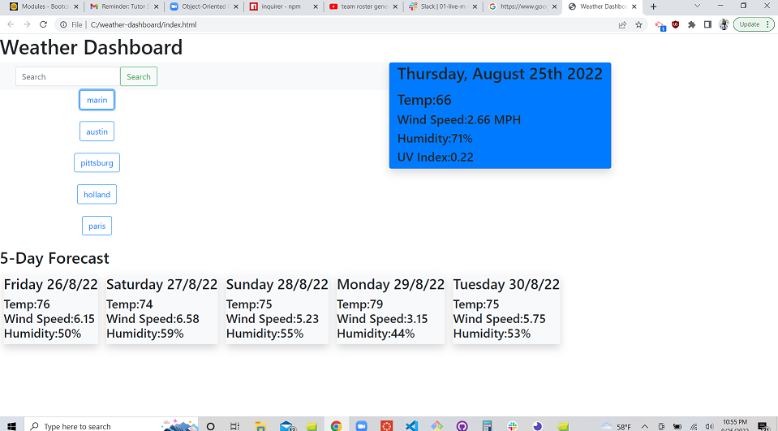

# weather-dashboard
Module 6 Challenge; Weather Dashboard

Browser application using fetch API calls to retreive weather data. 

When the user inputs a location into the search bar, an api call is first made to retreive the latitude and longitude of the location. That information is then used to create a second api call to retreive weather data. 

The current weather is placed into a separate, blue container. The 5-day forcast is placed into a row of cards underneath.

Search history is saved to local storage so that the last five searches are populated below the search bar for accessiblity. 

</>

link to deployed webpage: https://mconanan.github.io/weather-dashboard/

link to repository: https://github.com/mconanan/weather-dashboard